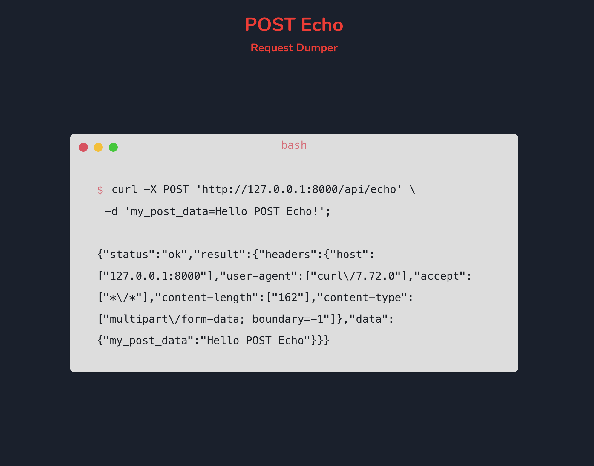

# POST Echo

30 minute project to create a service to help you troubleshoot HTTP requests.

Simply send a request to `/api/echo` and it will return a JSON response that echo's your request data and headers.

No data, information, or anything else is stored on the server.

Supported HTTP methods:

* GET
* POST
* PATCH
* PUT
* DELETE

Seriously, don't expect much, this was made in under an hour.
